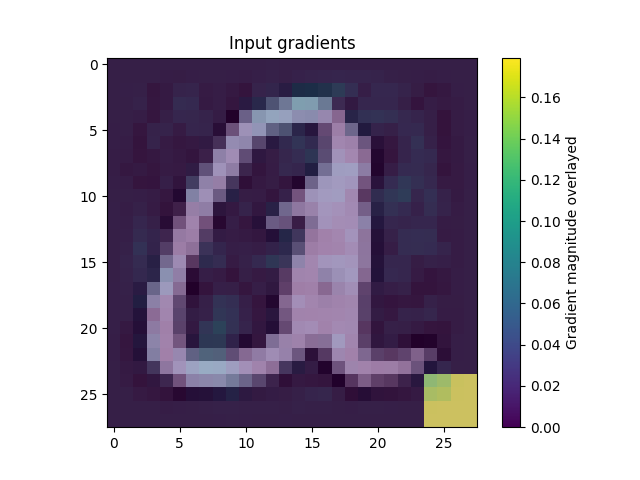

# C-HMCNN

This repository aims to show a novel interactive debugging protocol in which a machine and a user exchange arguments in support or against predictions.
This approach has been tested on a hierarchial setting, in particular leveraging on the code and data for the paper "[Coherent Hierarchical Multi-label Classification Networks](https://proceedings.neurips.cc/paper/2020/hash/6dd4e10e3296fa63738371ec0d5df818-Abstract.html)" and has later been
expanded with [Probabilistic Circuits](http://starai.cs.ucla.edu/papers/ProbCirc20.pdf).
The overall model has been adapted in order to work with multiple types of explainations.

## Author

This work is carried out by [Samuele Bortolotti](https://samuelebortolotti.github.io/) and [Stefano Teso](https://disi.unitn.it/~teso/).
The Coherent Hierarchical Multi-Label loss and consistency layer is taken from [C-HMCNN](https://github.com/EGiunchiglia/C-HMCNN) which was implemented by by [Eleonora Giunchiglia](https://www.cs.ox.ac.uk/people/eleonora.giunchiglia/) and [Thomas Lukasiewicz](https://www.cs.ox.ac.uk/people/thomas.lukasiewicz/).
[PySDD](https://github.com/wannesm/PySDD) has been used in order to employ probabilistic circuits. This Python package was developed by Arthur Choi, of the [Automated Reasoning Group at the University of California, Los Angeles](http://reasoning.cs.ucla.edu).

## About

The current implementation is developed on top of the C-HMCNN architecture.
And it offers the possibility to exploit both the approach introduced by the original authors and the one we propose.
The theory behind the code will be published once the project is complete.

As mentioned previously, the setting is **hierarchical**, specifically all the neural networks address the classification problem by means of a flat hierarchy.
The flat hierarchy consists in the output layer having one logit for each class (superclasses and subclasses) which represent the likelihood of that class.

## Getting Started

Follow these instructions to set up the project on your PC.

Moreover, to facilitate the use of the application, a Makefile has been provided; to see its functions, simply call the appropriate help command with [GNU/Make](https://www.gnu.org/software/make/)

 ```bash
 make help
 ```

### Clone the repository

 ```bash
 git clone https://github.com/samuelebortolotti/C-HMCNN.git
 cd C-HMNCNN
 ```

### Install the requirements

```bash
pip install --upgrade pip
pip install -r requirements.txt
```

> **Note**: it might be convenient to create a virtual enviroment to handle the dependencies.
> 
> The `Makefile` provides a simple and convenient way to manage Python virtual environments (see [venv](https://docs.python.org/3/tutorial/venv.html)).
> In order to create the virtual enviroment and install the requirements be sure you have the Python 3.9 (it should work even with more recent versions, however I have tested it only with 3.9)
> ```bash
> make env
> source ./venv/chmncnn/bin/activate
> make install
> ```
> Remember to deactivate the virtual enviroment once you have finished dealing with the project
> ```bash
> deactivate
> ```

Alternatively, you can use [`conda`](https://docs.conda.io/en/latest/) by typing:

```bash
conda env create --name chmncc --file=c-hmcnn_env.yml
```

### Generate the code documentation

The automatic code documentation is provided [Sphinx v4.5.0](https://www.sphinx-doc.org/en/master/).

In order to have the code documentation available, you need to install the development requirements

```bash
pip install --upgrade pip
pip install -r requirements.dev.txt
```

Since Sphinx commands are quite verbose, I suggest you to employ the following commands using the `Makefile`.

```bash
make doc-layout
make doc
```

The generated documentation will be accessible by opening `docs/build/html/index.html` in your browser, or equivalently by running

```bash
make open-doc
```

However, for the sake of completeness one may want to run the full Sphinx commands listed here.

```bash
sphinx-quickstart docs --sep --no-batchfile --project c-chmnnn --author "Samuele Bortolotti, Eleonora Giunchiglia and Thomas Lukasiewicz"  -r 0.1  --language en --extensions sphinx.ext.autodoc --extensions sphinx.ext.napoleon --extensions sphinx.ext.viewcode --extensions myst_parser
sphinx-apidoc -P -o docs/source .
cd docs; make html
```

> **Note**: executing the second list of command will lead to a slightly different documentation with respect to the one generated by the `Makefile`.
> This is because the above listed commands do not customize the index file of Sphinx. This is because the above listed commands do not customize the index file of Sphinx.

## Giunchiglia and Lukasiewicz approach

Here there is the list of all the functionality provided by Giunchiglia et al approach.

### Experiment

To set up base C-HMCNN you can run:

```bash
  python -m chmncc experiment [EXP_NAME] [EPOCHS_NUMBER] \
  --dataset <dataset_name> --seed <seed_num> --device <device_num> \
  --batch-size <batch_size> --test-batch-size <test_batch_size> \
  --learning-rate <learning-rate> --weigh-decay <weigh-decay> \
  --day <dry> --project <project> --entity <wandb-entity> --wandb <wandb> \
  --giunchiglia true \
```

Example:

```bash
python -m chmncc experiment exp_1 10 \
--dataset cellcycle_FUN --seed 0 --device 0
```

**Note:** the parameter passed to "dataset" must end with: '_FUN', '_GO', or '_others'.

If you want to execute the model for 10 seeds you can modify the script `main_script.sh` and execute it.

The results will be written in the folder `results/` in the file `<dataset_name>.csv`.

### Hyperparameters search

If you want to execute again the hyperparameters search you can modify the script `script.sh`according to your necessity and execute it. 

### Architecture

The code was run on a Titan Xp with 12GB memory. A description of the environment used and its dependencies is given in `c-hmcnn_enc.yml`.

By running the script `main_script.sh` we obtain the following results (average over the 10 runs):

| Dataset          | Result |
| ---------------- | ------ |
| Cellcycle_FUN    | 0.255  |
| Derisi_FUN       | 0.195  |
| Eisen_FUN        | 0.306  |
| Expr_FUN         | 0.302  |
| Gasch1_FUN       | 0.286  |
| Gasch2_FUN       | 0.258  |
| Seq_FUN          | 0.292  |
| Spo_FUN          | 0.215  |
| Cellcycle_GO     | 0.413  |
| Derisi_GO        | 0.370  |
| Eisen_GO         | 0.455  |
| Expr_GO          | 0.447  |
| Gasch1_GO        | 0.436  |
| Gasch2_GO        | 0.414  |
| Seq_GO           | 0.446  |
| Spo_GO           | 0.382  |
| Diatoms_others   | 0.758  |
| Enron_others     | 0.756  |
| Imclef07a_others | 0.956  |
| Imclef07d_others | 0.927  |


### Reference
```
@inproceedings{giunchiglia2020neurips,
    title     = {Coherent Hierarchical Multi-label Classification Networks},
    author    = {Eleonora Giunchiglia and
               Thomas Lukasiewicz},
    booktitle = {34th Conference on Neural Information Processing Systems (NeurIPS 2020)},
    address = {Vancouver, Canada},
    month = {December},
    year = {2020}
}
```

## Our approach

This repository comes with several neural networks, namely:

- multilayer perceptron;
- AlexNet;
- LeNet5;
- LeNet7 (An enhanced version of LeNet5);
- ResNet18.

The experiments has been carried out by training a simple MLP on [EMNIST](https://www.nist.gov/itl/products-and-services/emnist-dataset) in a hierarchical setting.

The experiments are carried out by confounding the model with two types of confounds:

- confound on the image, which consists in a patch placed at the bottom right of the image, with different shades of gray depending on the class of the example;
- dataset imbalance which leads the model to confuse one class for another due to a lack of examples to learn from.

During the training phase, the examples belonging to specific sub-classes are either confounded by means of the image or reduced in number. During the test phase, the confounds on the images are placed on samples belonging to classes different from those used during the training phase, while the dataset imbalance is removed.

### Dataset

The repository comes with four datasets, which could be specified in each stage of the process by means of the `--dataset` flag.

The dataset which are present are:

- [CIFAR-100](https://www.cs.toronto.edu/~kriz/cifar.html);
- [EMNIST]();
- [FashionMNIST]();
- [Omniglot]()

If you choose to carry out the experiments with CIFAR-100, you have to download and filter the dataset first.
To do so, you can employ the following `Makefile` command:

```bash
make dataset
```

Or equivalently, the following python command

```bash
python -m chmncc dataset
```

#### Hierarchies

All the provided datasets have been rearranged in order to be compliant with a hierarchical classification task, specifically the following hierarchies have been proposed:

##### CIFAR-100

| Subclass                                                 | Superclass                     |
| -------------------------------------------------------- | ------------------------------ |
| beaver, dolphin, otter, seal, whale                      | aquatic_mammals                |
| aquarium_fish, flatfish, ray, shark, trout               | fish                           |
| orchid, poppy, rose, sunflower, tulip                    | flowers                        |
| bottle, bowl, can, cup, plate                            | food_containers                |
| apple, mushroom, orange, pear, sweet_pepper              | fruit_and_vegetables           |
| clock, keyboard, lamp, telephone, television             | household_electrical_devices   |
| bed, chair, couch, table, wardrobe                       | household_furniture            |
| bee, beetle, butterfly, caterpillar, cockroach           | insects                        |
| bear, leopard, lion, tiger, wolf                         | large_carnivores               |
| bridge, castle, house, road, skyscraper                  | large_man-made_outdoor_things  |
| cloud, forest, mountain, plain, sea                      | large_natural_outdoor_scenes   |
| camel, cattle, chimpanzee, elephant, kangaroo            | large_omnivores_and_herbivores |
| fox, porcupine, possum, raccoon, skunk                   | medium_mammals                 |
| crab, lobster, snail, spider, worm                       | non-insect_invertebrates       |
| baby, boy, girl, man, woman                              | people                         |
| crocodile, dinosaur, lizard, snake, turtle               | reptiles                       |
| hamster, mouse, rabbit, shrew, squirrel                  | small_mammals                  |
| maple_tree, oak_tree, palm_tree, pine_tree, willow_tree  | trees                          |
| bicycle, bus, motorcycle, pickup_truck, train            | vehicles_1                     |
| lawn_mower, rocket, streetcar, tank, tractor             | vehicles_2                     |

##### EMNIST

| Subclass                                                                     | Superclass       |
| ---------------------------------------------------------------------------- | ---------------- |
| 0, 2, 4, 6, 8                                                                | even_digit       |
| 1, 3, 5, 7, 9                                                                | odd_digit        |
| a, b, c, d, e, f, g, h, i, j, k, l, m, n, o, p, q, r, s, t, u, v, w, x, y, z | lowercase_letter |
| A, B, C, D, E, F, G, H, I, J, K, L, M, N, O, P, Q, R, S, T, U, V, W, X, Y, Z | uppercase_letter |

##### FashionMNIST

| Subclass                           | Superclass |
| ---------------------------------- | ---------- |
| Sandal, Sneaker, Ankle boot        | shoe       |
| T-shirt/top, Pullover, Coat, Shirt | dress      |

##### Omniglot

| Subclass                                                                                                                                                                                                                                                                                                                                                                                                                                                                                                                                                                                                                                                                                                                                                                                                                                                                                                                                                                                                                                                                                                                                                                                                                                                                                                                                                                                                                                                                                                                                                                                                                                                                                                                                                                                                                                                                                                                                                                                                                                                   | Superclass                     |
| ---------------------------------------------------------------------------------------------------------------------------------------------------------------------------------------------------------------------------------------------------------------------------------------------------------------------------------------------------------------------------------------------------------------------------------------------------------------------------------------------------------------------------------------------------------------------------------------------------------------------------------------------------------------------------------------------------------------------------------------------------------------------------------------------------------------------------------------------------------------------------------------------------------------------------------------------------------------------------------------------------------------------------------------------------------------------------------------------------------------------------------------------------------------------------------------------------------------------------------------------------------------------------------------------------------------------------------------------------------------------------------------------------------------------------------------------------------------------------------------------------------------------------------------------------------------------------------------------------------------------------------------------------------------------------------------------------------------------------------------------------------------------------------------------------------------------------------------------------------------------------------------------------------------------------------------------------------------------------------------------------------------------------------------------------------- | ------------------------------ |
| Ge_ez/character15, Ge_ez/character06, Ge_ez/character02, Ge_ez/character07, Ge_ez/character23, Ge_ez/character12, Ge_ez/character24, Ge_ez/character22, Ge_ez/character13, Ge_ez/character26, Ge_ez/character21, Ge_ez/character20, Ge_ez/character14, Ge_ez/character03, Ge_ez/character04, Ge_ez/character01, Ge_ez/character25, Ge_ez/character10, Ge_ez/character18, Ge_ez/character11, Ge_ez/character17, Ge_ez/character05, Ge_ez/character08, Ge_ez/character19, Ge_ez/character09, Ge_ez/character16                                                                                                                                                                                                                                                                                                                                                                                                                                                                                                                                                                                                                                                                                                                                                                                                                                                                                                                                                                                                                                                                                                                                                                                                                                                                                                                                                                                                                                                                                                                                               | Ge_ez                          |
| Tengwar/character15, Tengwar/character06, Tengwar/character02, Tengwar/character07, Tengwar/character23, Tengwar/character12, Tengwar/character24, Tengwar/character22, Tengwar/character13, Tengwar/character21, Tengwar/character20, Tengwar/character14, Tengwar/character03, Tengwar/character04, Tengwar/character01, Tengwar/character25, Tengwar/character10, Tengwar/character18, Tengwar/character11, Tengwar/character17, Tengwar/character05, Tengwar/character08, Tengwar/character19, Tengwar/character09, Tengwar/character16                                                                                                                                                                                                                                                                                                                                                                                                                                                                                                                                                                                                                                                                                                                                                                                                                                                                                                                                                                                                                                                                                                                                                                                                                                                                                                                                                                                                                                                                                                                | Tengwar                        |
| Atlantean/character15, Atlantean/character06, Atlantean/character02, Atlantean/character07, Atlantean/character23, Atlantean/character12, Atlantean/character24, Atlantean/character22, Atlantean/character13, Atlantean/character26, Atlantean/character21, Atlantean/character20, Atlantean/character14, Atlantean/character03, Atlantean/character04, Atlantean/character01, Atlantean/character25, Atlantean/character10, Atlantean/character18, Atlantean/character11, Atlantean/character17, Atlantean/character05, Atlantean/character08, Atlantean/character19, Atlantean/character09, Atlantean/character16                                                                                                                                                                                                                                                                                                                                                                                                                                                                                                                                                                                                                                                                                                                                                                                                                                                                                                                                                                                                                                                                                                                                                                                                                                                                                                                                                                                                                                       | Atlantean                      |
| Sylheti/character15, Sylheti/character27, Sylheti/character06, Sylheti/character28, Sylheti/character02, Sylheti/character07, Sylheti/character23, Sylheti/character12, Sylheti/character24, Sylheti/character22, Sylheti/character13, Sylheti/character26, Sylheti/character21, Sylheti/character20, Sylheti/character14, Sylheti/character03, Sylheti/character04, Sylheti/character01, Sylheti/character25, Sylheti/character10, Sylheti/character18, Sylheti/character11, Sylheti/character17, Sylheti/character05, Sylheti/character08, Sylheti/character19, Sylheti/character09, Sylheti/character16                                                                                                                                                                                                                                                                                                                                                                                                                                                                                                                                                                                                                                                                                                                                                                                                                                                                                                                                                                                                                                                                                                                                                                                                                                                                                                                                                                                                                                                 | Sylheti                        |
| Glagolitic/character15, Glagolitic/character36, Glagolitic/character31, Glagolitic/character38, Glagolitic/character34, Glagolitic/character27, Glagolitic/character06, Glagolitic/character28, Glagolitic/character02, Glagolitic/character07, Glagolitic/character23, Glagolitic/character12, Glagolitic/character24, Glagolitic/character40, Glagolitic/character22, Glagolitic/character13, Glagolitic/character32, Glagolitic/character26, Glagolitic/character21, Glagolitic/character33, Glagolitic/character20, Glagolitic/character14, Glagolitic/character30, Glagolitic/character03, Glagolitic/character04, Glagolitic/character01, Glagolitic/character25, Glagolitic/character41, Glagolitic/character45, Glagolitic/character29, Glagolitic/character39, Glagolitic/character10, Glagolitic/character42, Glagolitic/character37, Glagolitic/character18, Glagolitic/character11, Glagolitic/character17, Glagolitic/character05, Glagolitic/character08, Glagolitic/character19, Glagolitic/character43, Glagolitic/character09, Glagolitic/character16, Glagolitic/character35, Glagolitic/character44                                                                                                                                                                                                                                                                                                                                                                                                                                                                                                                                                                                                                                                                                                                                                                                                                                                                                                                                     | Glagolitic                     |
| Atemayar_Qelisayer/character15, Atemayar_Qelisayer/character06, Atemayar_Qelisayer/character02, Atemayar_Qelisayer/character07, Atemayar_Qelisayer/character23, Atemayar_Qelisayer/character12, Atemayar_Qelisayer/character24, Atemayar_Qelisayer/character22, Atemayar_Qelisayer/character13, Atemayar_Qelisayer/character26, Atemayar_Qelisayer/character21, Atemayar_Qelisayer/character20, Atemayar_Qelisayer/character14, Atemayar_Qelisayer/character03, Atemayar_Qelisayer/character04, Atemayar_Qelisayer/character01, Atemayar_Qelisayer/character25, Atemayar_Qelisayer/character10, Atemayar_Qelisayer/character18, Atemayar_Qelisayer/character11, Atemayar_Qelisayer/character17, Atemayar_Qelisayer/character05, Atemayar_Qelisayer/character08, Atemayar_Qelisayer/character19, Atemayar_Qelisayer/character09, Atemayar_Qelisayer/character16                                                                                                                                                                                                                                                                                                                                                                                                                                                                                                                                                                                                                                                                                                                                                                                                                                                                                                                                                                                                                                                                                                                                                                                             | Atemayar_Qelisayer             |
| Old_Church_Slavonic_(Cyrillic)/character15, Old_Church_Slavonic_(Cyrillic)/character36, Old_Church_Slavonic_(Cyrillic)/character31, Old_Church_Slavonic_(Cyrillic)/character38, Old_Church_Slavonic_(Cyrillic)/character34, Old_Church_Slavonic_(Cyrillic)/character27, Old_Church_Slavonic_(Cyrillic)/character06, Old_Church_Slavonic_(Cyrillic)/character28, Old_Church_Slavonic_(Cyrillic)/character02, Old_Church_Slavonic_(Cyrillic)/character07, Old_Church_Slavonic_(Cyrillic)/character23, Old_Church_Slavonic_(Cyrillic)/character12, Old_Church_Slavonic_(Cyrillic)/character24, Old_Church_Slavonic_(Cyrillic)/character40, Old_Church_Slavonic_(Cyrillic)/character22, Old_Church_Slavonic_(Cyrillic)/character13, Old_Church_Slavonic_(Cyrillic)/character32, Old_Church_Slavonic_(Cyrillic)/character26, Old_Church_Slavonic_(Cyrillic)/character21, Old_Church_Slavonic_(Cyrillic)/character33, Old_Church_Slavonic_(Cyrillic)/character20, Old_Church_Slavonic_(Cyrillic)/character14, Old_Church_Slavonic_(Cyrillic)/character30, Old_Church_Slavonic_(Cyrillic)/character03, Old_Church_Slavonic_(Cyrillic)/character04, Old_Church_Slavonic_(Cyrillic)/character01, Old_Church_Slavonic_(Cyrillic)/character25, Old_Church_Slavonic_(Cyrillic)/character41, Old_Church_Slavonic_(Cyrillic)/character45, Old_Church_Slavonic_(Cyrillic)/character29, Old_Church_Slavonic_(Cyrillic)/character39, Old_Church_Slavonic_(Cyrillic)/character10, Old_Church_Slavonic_(Cyrillic)/character42, Old_Church_Slavonic_(Cyrillic)/character37, Old_Church_Slavonic_(Cyrillic)/character18, Old_Church_Slavonic_(Cyrillic)/character11, Old_Church_Slavonic_(Cyrillic)/character17, Old_Church_Slavonic_(Cyrillic)/character05, Old_Church_Slavonic_(Cyrillic)/character08, Old_Church_Slavonic_(Cyrillic)/character19, Old_Church_Slavonic_(Cyrillic)/character43, Old_Church_Slavonic_(Cyrillic)/character09, Old_Church_Slavonic_(Cyrillic)/character16, Old_Church_Slavonic_(Cyrillic)/character35, Old_Church_Slavonic_(Cyrillic)/character44 | Old_Church_Slavonic_(Cyrillic) |
| ULOG/character15, ULOG/character06, ULOG/character02, ULOG/character07, ULOG/character23, ULOG/character12, ULOG/character24, ULOG/character22, ULOG/character13, ULOG/character26, ULOG/character21, ULOG/character20, ULOG/character14, ULOG/character03, ULOG/character04, ULOG/character01, ULOG/character25, ULOG/character10, ULOG/character18, ULOG/character11, ULOG/character17, ULOG/character05, ULOG/character08, ULOG/character19, ULOG/character09, ULOG/character16                                                                                                                                                                                                                                                                                                                                                                                                                                                                                                                                                                                                                                                                                                                                                                                                                                                                                                                                                                                                                                                                                                                                                                                                                                                                                                                                                                                                                                                                                                                                                                         | ULOG                           |
| Aurek-Besh/character15, Aurek-Besh/character06, Aurek-Besh/character02, Aurek-Besh/character07, Aurek-Besh/character23, Aurek-Besh/character12, Aurek-Besh/character24, Aurek-Besh/character22, Aurek-Besh/character13, Aurek-Besh/character26, Aurek-Besh/character21, Aurek-Besh/character20, Aurek-Besh/character14, Aurek-Besh/character03, Aurek-Besh/character04, Aurek-Besh/character01, Aurek-Besh/character25, Aurek-Besh/character10, Aurek-Besh/character18, Aurek-Besh/character11, Aurek-Besh/character17, Aurek-Besh/character05, Aurek-Besh/character08, Aurek-Besh/character19, Aurek-Besh/character09, Aurek-Besh/character16                                                                                                                                                                                                                                                                                                                                                                                                                                                                                                                                                                                                                                                                                                                                                                                                                                                                                                                                                                                                                                                                                                                                                                                                                                                                                                                                                                                                             | Aurek-Besh                     |
| Syriac_(Serto)/character15, Syriac_(Serto)/character06, Syriac_(Serto)/character02, Syriac_(Serto)/character07, Syriac_(Serto)/character23, Syriac_(Serto)/character12, Syriac_(Serto)/character22, Syriac_(Serto)/character13, Syriac_(Serto)/character21, Syriac_(Serto)/character20, Syriac_(Serto)/character14, Syriac_(Serto)/character03, Syriac_(Serto)/character04, Syriac_(Serto)/character01, Syriac_(Serto)/character10, Syriac_(Serto)/character18, Syriac_(Serto)/character11, Syriac_(Serto)/character17, Syriac_(Serto)/character05, Syriac_(Serto)/character08, Syriac_(Serto)/character19, Syriac_(Serto)/character09, Syriac_(Serto)/character16                                                                                                                                                                                                                                                                                                                                                                                                                                                                                                                                                                                                                                                                                                                                                                                                                                                                                                                                                                                                                                                                                                                                                                                                                                                                                                                                                                                         | Syriac_(Serto)                 |
| Oriya/character15, Oriya/character36, Oriya/character31, Oriya/character38, Oriya/character34, Oriya/character27, Oriya/character06, Oriya/character28, Oriya/character02, Oriya/character07, Oriya/character23, Oriya/character12, Oriya/character24, Oriya/character40, Oriya/character22, Oriya/character13, Oriya/character32, Oriya/character26, Oriya/character21, Oriya/character33, Oriya/character20, Oriya/character14, Oriya/character30, Oriya/character03, Oriya/character04, Oriya/character01, Oriya/character25, Oriya/character41, Oriya/character45, Oriya/character29, Oriya/character39, Oriya/character10, Oriya/character42, Oriya/character37, Oriya/character18, Oriya/character11, Oriya/character17, Oriya/character05, Oriya/character08, Oriya/character46, Oriya/character19, Oriya/character43, Oriya/character09, Oriya/character16, Oriya/character35, Oriya/character44                                                                                                                                                                                                                                                                                                                                                                                                                                                                                                                                                                                                                                                                                                                                                                                                                                                                                                                                                                                                                                                                                                                                                   | Oriya                          |
| Mongolian/character15, Mongolian/character27, Mongolian/character06, Mongolian/character28, Mongolian/character02, Mongolian/character07, Mongolian/character23, Mongolian/character12, Mongolian/character24, Mongolian/character22, Mongolian/character13, Mongolian/character26, Mongolian/character21, Mongolian/character20, Mongolian/character14, Mongolian/character30, Mongolian/character03, Mongolian/character04, Mongolian/character01, Mongolian/character25, Mongolian/character29, Mongolian/character10, Mongolian/character18, Mongolian/character11, Mongolian/character17, Mongolian/character05, Mongolian/character08, Mongolian/character19, Mongolian/character09, Mongolian/character16                                                                                                                                                                                                                                                                                                                                                                                                                                                                                                                                                                                                                                                                                                                                                                                                                                                                                                                                                                                                                                                                                                                                                                                                                                                                                                                                           | Mongolian                      |
| Manipuri/character15, Manipuri/character36, Manipuri/character31, Manipuri/character38, Manipuri/character34, Manipuri/character27, Manipuri/character06, Manipuri/character28, Manipuri/character02, Manipuri/character07, Manipuri/character23, Manipuri/character12, Manipuri/character24, Manipuri/character40, Manipuri/character22, Manipuri/character13, Manipuri/character32, Manipuri/character26, Manipuri/character21, Manipuri/character33, Manipuri/character20, Manipuri/character14, Manipuri/character30, Manipuri/character03, Manipuri/character04, Manipuri/character01, Manipuri/character25, Manipuri/character29, Manipuri/character39, Manipuri/character10, Manipuri/character37, Manipuri/character18, Manipuri/character11, Manipuri/character17, Manipuri/character05, Manipuri/character08, Manipuri/character19, Manipuri/character09, Manipuri/character16, Manipuri/character35                                                                                                                                                                                                                                                                                                                                                                                                                                                                                                                                                                                                                                                                                                                                                                                                                                                                                                                                                                                                                                                                                                                                             | Manipuri                       |
| Angelic/character15, Angelic/character06, Angelic/character02, Angelic/character07, Angelic/character12, Angelic/character13, Angelic/character20, Angelic/character14, Angelic/character03, Angelic/character04, Angelic/character01, Angelic/character10, Angelic/character18, Angelic/character11, Angelic/character17, Angelic/character05, Angelic/character08, Angelic/character19, Angelic/character09, Angelic/character16                                                                                                                                                                                                                                                                                                                                                                                                                                                                                                                                                                                                                                                                                                                                                                                                                                                                                                                                                                                                                                                                                                                                                                                                                                                                                                                                                                                                                                                                                                                                                                                                                         | Angelic                        |
| Tibetan/character15, Tibetan/character36, Tibetan/character31, Tibetan/character38, Tibetan/character34, Tibetan/character27, Tibetan/character06, Tibetan/character28, Tibetan/character02, Tibetan/character07, Tibetan/character23, Tibetan/character12, Tibetan/character24, Tibetan/character40, Tibetan/character22, Tibetan/character13, Tibetan/character32, Tibetan/character26, Tibetan/character21, Tibetan/character33, Tibetan/character20, Tibetan/character14, Tibetan/character30, Tibetan/character03, Tibetan/character04, Tibetan/character01, Tibetan/character25, Tibetan/character41, Tibetan/character29, Tibetan/character39, Tibetan/character10, Tibetan/character42, Tibetan/character37, Tibetan/character18, Tibetan/character11, Tibetan/character17, Tibetan/character05, Tibetan/character08, Tibetan/character19, Tibetan/character09, Tibetan/character16, Tibetan/character35                                                                                                                                                                                                                                                                                                                                                                                                                                                                                                                                                                                                                                                                                                                                                                                                                                                                                                                                                                                                                                                                                                                                           | Tibetan                        |
| Malayalam/character15, Malayalam/character36, Malayalam/character31, Malayalam/character38, Malayalam/character34, Malayalam/character27, Malayalam/character06, Malayalam/character28, Malayalam/character02, Malayalam/character07, Malayalam/character23, Malayalam/character12, Malayalam/character24, Malayalam/character40, Malayalam/character47, Malayalam/character22, Malayalam/character13, Malayalam/character32, Malayalam/character26, Malayalam/character21, Malayalam/character33, Malayalam/character20, Malayalam/character14, Malayalam/character30, Malayalam/character03, Malayalam/character04, Malayalam/character01, Malayalam/character25, Malayalam/character41, Malayalam/character45, Malayalam/character29, Malayalam/character39, Malayalam/character10, Malayalam/character42, Malayalam/character37, Malayalam/character18, Malayalam/character11, Malayalam/character17, Malayalam/character05, Malayalam/character08, Malayalam/character46, Malayalam/character19, Malayalam/character43, Malayalam/character09, Malayalam/character16, Malayalam/character35, Malayalam/character44                                                                                                                                                                                                                                                                                                                                                                                                                                                                                                                                                                                                                                                                                                                                                                                                                                                                                                                                    | Malayalam                      |
| Kannada/character15, Kannada/character36, Kannada/character31, Kannada/character38, Kannada/character34, Kannada/character27, Kannada/character06, Kannada/character28, Kannada/character02, Kannada/character07, Kannada/character23, Kannada/character12, Kannada/character24, Kannada/character40, Kannada/character22, Kannada/character13, Kannada/character32, Kannada/character26, Kannada/character21, Kannada/character33, Kannada/character20, Kannada/character14, Kannada/character30, Kannada/character03, Kannada/character04, Kannada/character01, Kannada/character25, Kannada/character41, Kannada/character29, Kannada/character39, Kannada/character10, Kannada/character37, Kannada/character18, Kannada/character11, Kannada/character17, Kannada/character05, Kannada/character08, Kannada/character19, Kannada/character09, Kannada/character16, Kannada/character35                                                                                                                                                                                                                                                                                                                                                                                                                                                                                                                                                                                                                                                                                                                                                                                                                                                                                                                                                                                                                                                                                                                                                                | Kannada                        |
| Gurmukhi/character15, Gurmukhi/character36, Gurmukhi/character31, Gurmukhi/character38, Gurmukhi/character34, Gurmukhi/character27, Gurmukhi/character06, Gurmukhi/character28, Gurmukhi/character02, Gurmukhi/character07, Gurmukhi/character23, Gurmukhi/character12, Gurmukhi/character24, Gurmukhi/character40, Gurmukhi/character22, Gurmukhi/character13, Gurmukhi/character32, Gurmukhi/character26, Gurmukhi/character21, Gurmukhi/character33, Gurmukhi/character20, Gurmukhi/character14, Gurmukhi/character30, Gurmukhi/character03, Gurmukhi/character04, Gurmukhi/character01, Gurmukhi/character25, Gurmukhi/character41, Gurmukhi/character45, Gurmukhi/character29, Gurmukhi/character39, Gurmukhi/character10, Gurmukhi/character42, Gurmukhi/character37, Gurmukhi/character18, Gurmukhi/character11, Gurmukhi/character17, Gurmukhi/character05, Gurmukhi/character08, Gurmukhi/character19, Gurmukhi/character43, Gurmukhi/character09, Gurmukhi/character16, Gurmukhi/character35, Gurmukhi/character44                                                                                                                                                                                                                                                                                                                                                                                                                                                                                                                                                                                                                                                                                                                                                                                                                                                                                                                                                                                                                               | Gurmukhi                       |
| Avesta/character15, Avesta/character06, Avesta/character02, Avesta/character07, Avesta/character23, Avesta/character12, Avesta/character24, Avesta/character22, Avesta/character13, Avesta/character26, Avesta/character21, Avesta/character20, Avesta/character14, Avesta/character03, Avesta/character04, Avesta/character01, Avesta/character25, Avesta/character10, Avesta/character18, Avesta/character11, Avesta/character17, Avesta/character05, Avesta/character08, Avesta/character19, Avesta/character09, Avesta/character16                                                                                                                                                                                                                                                                                                                                                                                                                                                                                                                                                                                                                                                                                                                                                                                                                                                                                                                                                                                                                                                                                                                                                                                                                                                                                                                                                                                                                                                                                                                     | Avesta                         |
| Keble/character15, Keble/character06, Keble/character02, Keble/character07, Keble/character23, Keble/character12, Keble/character24, Keble/character22, Keble/character13, Keble/character26, Keble/character21, Keble/character20, Keble/character14, Keble/character03, Keble/character04, Keble/character01, Keble/character25, Keble/character10, Keble/character18, Keble/character11, Keble/character17, Keble/character05, Keble/character08, Keble/character19, Keble/character09, Keble/character16                                                                                                                                                                                                                                                                                                                                                                                                                                                                                                                                                                                                                                                                                                                                                                                                                                                                                                                                                                                                                                                                                                                                                                                                                                                                                                                                                                                                                                                                                                                                               | Keble                          |

### Train and test

After the dataset is ready, you can perform an experiment by typing:

```bash
make experiment
```

Or equivalently, the following python command

```bash
python -m chmncc experiment [EXP_NAME] [EPOCHS_NUMBER] \
--learning-rate <learning-rate> --batch-size <train-batch-size> \
--test-batch-size <test-batch-size> --device <device>
```

As an effective representation, a valid command is the following:

```bash
python -m chmncc experiment "chmncc" 50 --learning-rate 0.001 \
--batch-size 128 --test-batch-size 128 --device cuda
```

> **Note:** `run.sh` is the Slurm script I employ to run the code on the University cluster

The statistics which are tracked during the training procedure are:

- Statistics tracked during training (on training set):

    - `train/train_hamming_loss`: classification hamming loss (the output of each logit is a probability);
    - `train/train_jaccard`: jaccard similarity cefficient score, see [Jaccard index](https://en.wikipedia.org/wiki/Jaccard_index);
    - `train/train_auprc_raw`: classifier area under precision-recall curve;
    - `train/train_right_anwer_loss`: classifier right answer loss (on a dataset different than the training set);
    - `train/train_right_reason_loss`: classifier right reason loss (on a dataset different than the training set);
    - `train/train_accuracy`: classifier accuracy;
    - `train/train_loss`: binary cross entropy training loss.

- Statistics tracked during validation (on validation set):

    - `val/val_hamming_loss`: classification hamming loss (the output of each logit is a probability);
    - `val/val_jaccard`: jaccard similarity cefficient score, see [Jaccard index](https://en.wikipedia.org/wiki/Jaccard_index);
    - `val/val_auprc_raw`: classifier area under precision-recall curve;
    - `val/val_accuracy`: classifier accuracy;
    - `val/val_loss`: binary cross entropy validation loss.

- Statistics tracked during validation (on test set):

    - `test/test_hamming_loss`: classification hamming loss (the output of each logit is a probability);
    - `test/test_jaccard`: jaccard similarity cefficient score, see [Jaccard index](https://en.wikipedia.org/wiki/Jaccard_index);
    - `test/test_auprc_raw`: classifier area under precision-recall curve;
    - `test/test_right_anwer_loss`: classifier right answer loss;
    - `test/test_right_reason_loss`: classifier right reason loss;
    - `test/test_accuracy`: classifier accuracy;
    - `test/test_loss`: binary cross entropy test loss.

Finally the `learning_rate` is tracked.

At the end of the procedure you will be able to consult them through the logs or the training curves on `wandb` if set up.

The `experiment` consists in training a model which is confounded both on the labels and on the images.

You can set up which class you want to confound as follows:

1. Go to `chmncc/config`;
2. If you want to add confounders on the image, you need to edit the file named `confounders.py`. 
The structure of the file is fairly simple, it consists in four dictionaries which depict where to place the confouders and how the confounders should be.
As an example, if I am willing to use FashionMNIST and I want to place a 4x4 grayscale confounder on the class `Sandal` during the training phase while placing it on the subclass `T-shirt/top` during the test phase I can rearrange 
the `fashion_confunders` dictionary as follows:

```python
fashion_confunders = {
    "shoe": {
        "train": [
            {
                "subclass": "Sandal",  # subclass on which to apply the confunders
                "color": 85,           # grayscale color
                "shape": "rectangle",  # choose from [rectangle, circle]
                "type": "full",        # either full or empty (empty means only the border will be present)
                "min_dim": 4,          # minimum dimension
                "max_dim": 4,          # maximum dimension in pixels
            }
        ],
        "test": [],
    },
    "dress": {
        "train": [],
        "test": [
            {
                "subclass": "T-shirt/top",  # subclass on which to apply the confunders
                "color": 85,                # grayscale color
                "shape": "rectangle",       # choose from [rectangle, circle]
                "type": "full",             # either full or empty
                "min_dim": 4,               # minimum dimension
                "max_dim": 4,               # maximum dimension in pixels
            }
        ],
    },
}
```

3. If you want to confound the labels instead, you need to edit the `label_confounders.py` file. The file contains t dictionary which comprises the different datasets. For each dataset you can specify which class should be rebalanced and what weight to apply (in percentage).
As an effective representation, if I want to have 5% of the total examples of the 'O', 'S' and 'T' classes of the EMNIST dataset I can type:

```python
label_confounders = {
    "mnist": {
        "uppercase_letter": {
            "subclasses": ["O", "S", "T"],
            "weight": [0.05, 0.05, 0.05],
        },
    },
    "cifar": {},
    "omniglot": {},
    "fashion": {},
}
```

In order to run the `experiment` you have to specify several arguments which can be explored by means of the `--help` command as follows:

```bash
python -m chmncc experiment --help
```

For sake of completeness, here are the description of the most relevant arguments:

- `dataset`: which is the name of the dataset to use (chose from: cifar, mnist, fashion, omniglot);
- `epochs`: number of epochs;
- `batch-size`: train batch size;
- `test-batch-size`: test batch size;
- `learning-rate`: learning rate;
- `network`: which neural network to employ (chose from: lenet, lenet7, alexnet, mlp);
- `confound`: whether to confond the network using image confounders;
- `force-prediction`: always perform a prediction, namely use as prediction the logit with the highest likelihood if none is greater than the prediction threshold;
- `fixed-confounder`: put the confounders in the bottom right corner of the image;
- `no-fixed-confounder`: put the confounders in random position in the image (for the same image the confonuder is always placed in the same position);
- `imbalance-dataset`: introduce the confounder on the label by imbalancing the dataset;
- `use-probabilistic-circuit`: use the probabilistic circuits.

Finally, I provide an example of a training command:

```bash
python -m chmncc  experiment "chmncc" 50 --learning-rate 0.001 --batch-size 128 --test-batch-size 128 --device cuda \
--project chmncc --network mlp --wandb true --project chmncc --num-workers 8 --prediction-treshold 0.5 --patience 10 \
--fixed-confounder --dataset mnist --force-prediction --imbalance-dataset --use-probabilistic-circuits --num-reps 4 --gates 4
```

Or you can edit the `Makefile` and run:

```bash
make experiment
```

Moreover, the procedure produces some visual results, namely:

1. Input gradients on some confounded samples;
2. Confusion matrix;
3. Bar plots showing the accuracy, prediction rate and the network predictions on samples of confounded labels.

Here I show some examples:

1. 
2. 
3. 

The models produced in this phase are:

- `net.pth`, the models parameters produced at each training iteration;
- `ckpt_e{}.pth`, the model checkpoint (it is saved every `n` epochs, which is specified in the training parameters);
- `best.pth`, the best model obtained (according to the stopped criterion basically), namely the one whose auprc score has achieved the best values during training;
- `last.pth`, the model obtained after the last training epoch.

If the gate is employed then there is a `gate.pth` counterpart for each of the above models.

### Revise

The revise step consists in fixing the model belifs by getting rid of the confounders.

As mentioned previously, there are two kind of confounders: label and image.

For the label confounders it is possible to employ two different strategies:

- either by duplicating the samples of the confounded classes (the duplication is physical);
- or by employing a weighted binary cross entropy loss where the weights are greater for confounded classes

While for the image confounders, the [RRR](https://arxiv.org/abs/1703.03717) loss is employed.
The crucial parameter for the Right for the Right Reason is the regularization rate, which is used to balance the right answers and the right reasons term to have similar orders of magnitude.

The statistics produced during the correction phase are the following:

- Statistics tracked during training (on training set):

    - `train/train_hamming_loss`: classification hamming loss (the output of each logit is a probability);
    - `train/train_jaccard`: jaccard similarity cefficient score, see [Jaccard index](https://en.wikipedia.org/wiki/Jaccard_index);
    - `train/train_auprc_raw`: classifier area under precision-recall curve;
    - `train/train_confounded_samples_only_right_reason`: classifier right reason loss (on confounded samples only set);
    - `train/train_right_answer_loss`: classifier right answer loss (on a dataset different than the training set);
    - `train/train_right_reason_loss`: classifier right reason loss (on a dataset different than the training set);
    - `train/train_accuracy`: classifier accuracy;
    - `train/train_loss`: binary cross entropy training loss.

- Statistics tracked during validation (on validation set):

    - `val/val_hamming_loss`: classification hamming loss (the output of each logit is a probability);
    - `val/val_jaccard`: jaccard similarity cefficient score, see [Jaccard index](https://en.wikipedia.org/wiki/Jaccard_index);
    - `val/val_auprc_raw`: classifier area under precision-recall curve;
    - `val/val_loss`: binary cross entropy validation loss.
    - `val/val_accuracy`: classifier accuracy;

- Statistics tracked during validation (on test set):

    - `test/test_hamming_loss`: classification hamming loss (the output of each logit is a probability);
    - `test/test_jaccard`: jaccard similarity cefficient score, see [Jaccard index](https://en.wikipedia.org/wiki/Jaccard_index);
    - `test/only_training_confounded_classes_without_confounders_auprc_raw`: Area Under Precision Recall Curve computed on images NOT confounded on images on the training images;
    - `test/only_test_confounded_classes_without_confounders_auprc_raw`: Area Under Precision Recall Curve computed on images NOT confounded on images on the training images;
    - `test/only_test_confounded_classes_auprc_raw`: Area Under Precision Recall Curve computed on images confounded on images on the training images;
    - `test/test_right_reason_loss`: classifier right answer loss;
    - `test/test_auprc_raw`: classifier area under precision-recall curve;
    - `test/test_right_answer_loss`: classifier right answer loss;
    - `test/test_accuracy`: classifier accuracy;
    - `test/test_loss`: binary cross entropy test loss.

Finally the `learning_rate` is tracked.

The corrected models during the correction phase is saved in the following file `after_training_debug_{1}_{2}.pth`, where `{1}` is the name of the model and `{2}` is the type of gradients employed in the Right for the Right Reason loss.

As an effecti e representation, you can correct a model by typing:

```bash
python -m chmncc.__main__ debug --learning-rate 0.001 --batch-size 128 --test-batch-size 128 --device cuda \
--project chmncc --wandb true --network mlp --iterations 50 --no-gradient-analysis --rrr-regularization-rate 0.3 \
--no-integrated-gradients --num-workers 8 --prediction-treshold 0.5 --patience 10 --fixed-confounder --dataset mnist \
--force-prediction --imbalance-dataset --balance-subclasses O S T --balance-weights 100.0 100.0 100.0 \
--correct-by-duplicating-samples --use-probabilistic-circuits --num-reps 4 --gates 4
```

### Arguments

In order for the machine to provide the best arguments, it is necessary to define a score with which the arguments are ranked.
During this project lifetime we have tried several types of score which have led to different results.
The aim of this subcommand is to allow you to generate charts which depict how a certain score behave in different confound situations.

Ideally, a suitable score should comply with the following table, where tau is a user defined constant:

|                                  | # X > tau | # Y > tau | # X > Y |
| -------------------------------- | --------- | --------- | ------- |
| Confound on image                | Y         | -         | Y       |
| Confound on label                | -         | Y         | X       |
| Confound on both image and label | Y         | Y         | -       |
| Not confounded                   | -         | -         | -       |

Where "-" means that there is no particular preference on the value; "Y" means that the condition should hold for most or all the examples, while "X" means the opposite

The types of charts which are produced are:

- barplot showing whether the Giunchiglia et al. `max` layer mechanism has been triggered for the prediction and for the groundtruth;
- boxplot showing the gradient distribution both for input and label gradients;
- barplot showing the class predicted for label confounded samples;
- scatter plot showing the gradient values both for input and label gradients;
- the above table filled with the count of samples fulfilling those properties

### Multi Step Argumentations

This functionality is still under development. 

Ideally it should allow the user to chose arguments regarding a machine's wrong prediction and exchange multiple arguments between the machine and user.

You can explore the command line arguments regarding this option as follows:

```bash
python -m chmncc multi-step-argumentation --help
```

Or you can edit the `Makefile` and run:

```bash
make multi-step-argumentation
```
